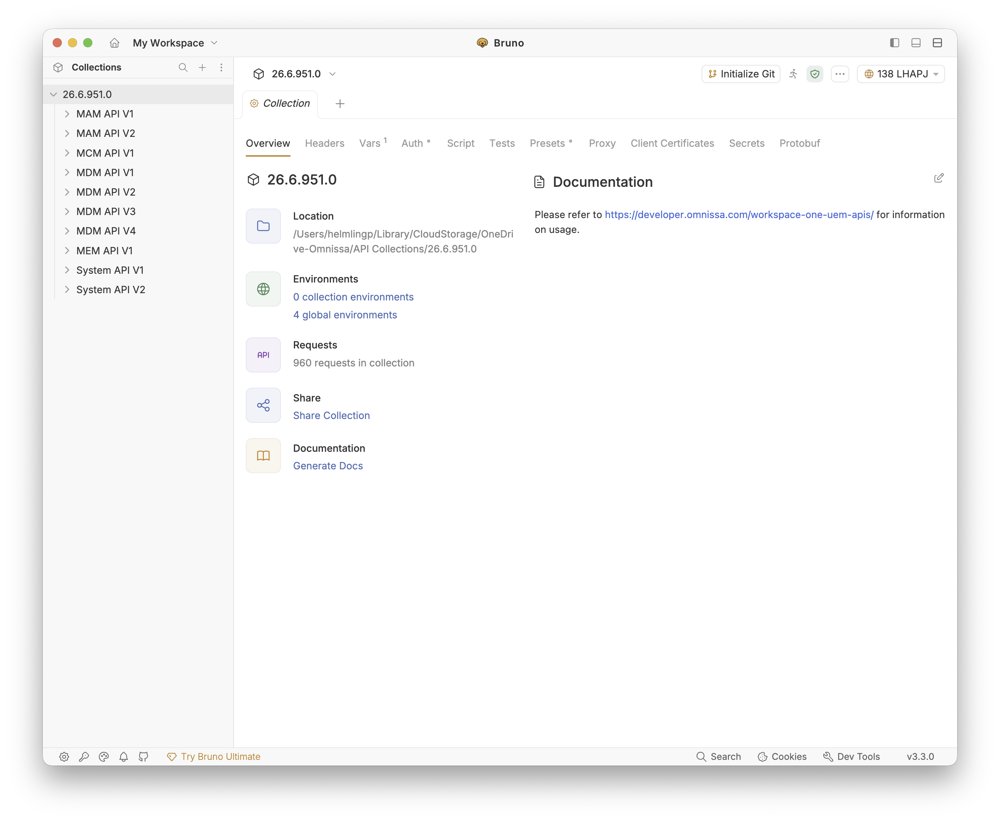
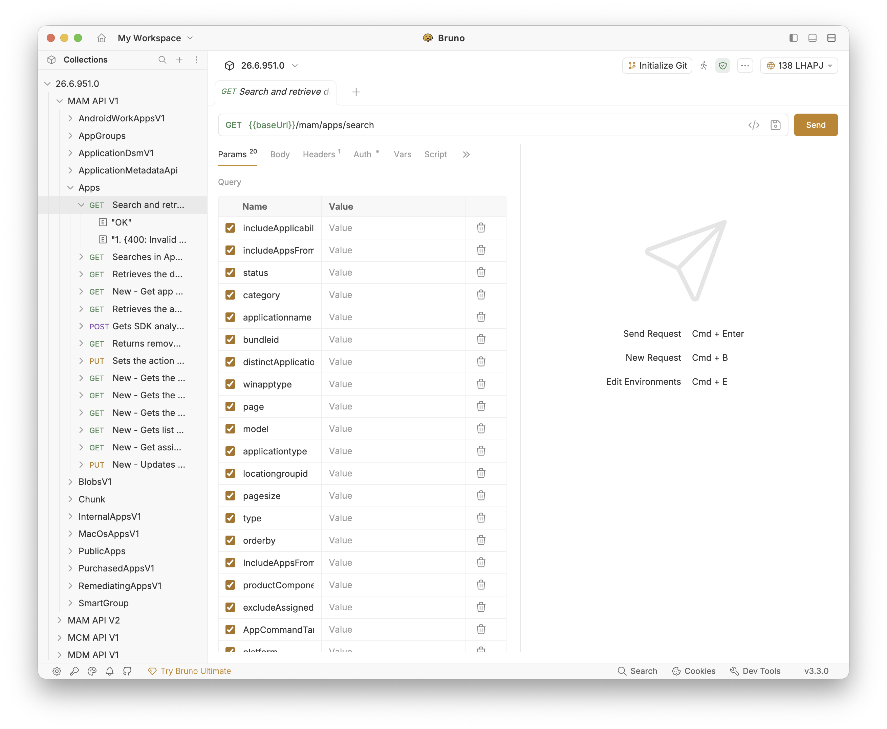
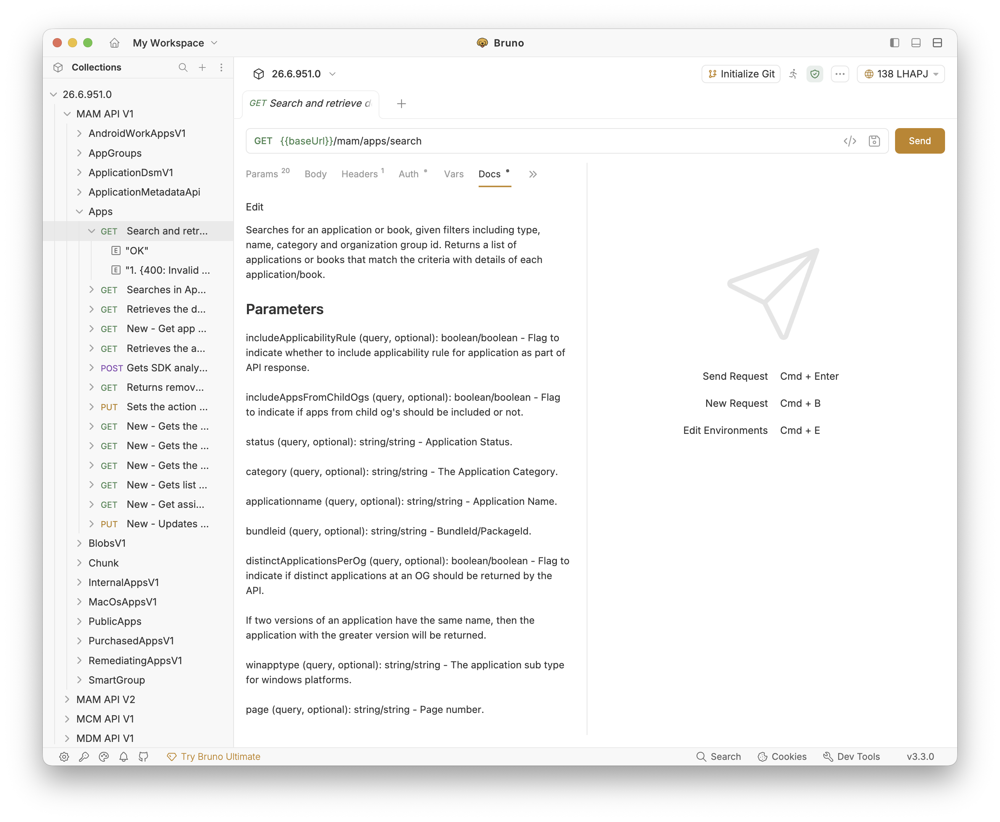
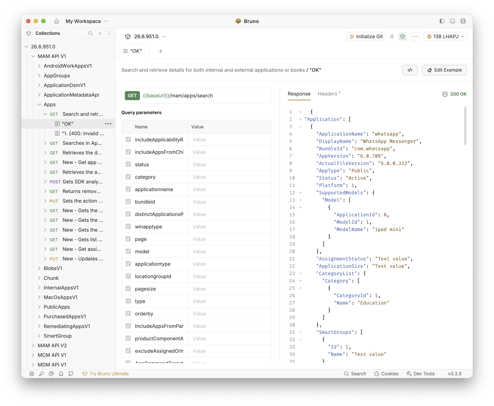

# create_wsone_api_bruno_collection

PowerShell utility to generate a Bruno API collection from a Workspace ONE UEM server.

## What It Does

The script:

1. Prompts for (or accepts) Workspace ONE server and OAuth credentials.
2. Requests an OAuth2 access token.
3. Reads server version from `/api/system/info`.
4. Creates a versioned Bruno collection folder.
5. Downloads OpenAPI docs and converts endpoints into `.bru` requests.
6. Configures generated requests to inherit auth.

## Requirements

- PowerShell 5.1 or later
- Workspace ONE UEM with OAuth2 client credentials
- Access to the UEM API endpoints

## Script

- `create-bruno.ps1`

## Usage

Run with prompts:

```powershell
powershell.exe -ExecutionPolicy Bypass -File .\create-bruno.ps1
```

Run with parameters:

```powershell
powershell.exe -ExecutionPolicy Bypass -File .\create-bruno.ps1 `
  -clientId "YOUR_CLIENT_ID" `
  -clientSecret "YOUR_CLIENT_SECRET" `
  -tokenUrl "https://your-oauth-host/connect/token" `
  -Server "https://apiXXX.awmdm.com"
```

## Output

The script generates Bruno collection folders and `.bru` request files based on the server's API docs.

Each generated request includes comprehensive documentation with:

- **Operation Description** — summary of what the endpoint does
- **Parameters** — all path and query parameters with types, required status, and descriptions
- **Request Body Schema** — detailed schema for request payloads with nested object/array structures
- **Response Schema** — schema definitions for all response body types
- **Responses** — HTTP status codes with descriptions and content types

Documentation is embedded in each `.bru` file's `docs` block and rendered in Bruno's request editor for quick reference.

## Bruno Usage

From within Bruno, open the new collection by pointing at the new folder. Bruno will scan the file system and then present the Collection for the specific release of the target server. Each release splits MAM, MCM, MDM, MEM, and System REST API calls into separate folders (one OpenAPI document per API family).


This script will create each API call in the respective API family folder and include:
- Parameters

- Documentation, and

- Responses (including schema)


## License

This project is licensed under the MIT License. See `LICENSE`.